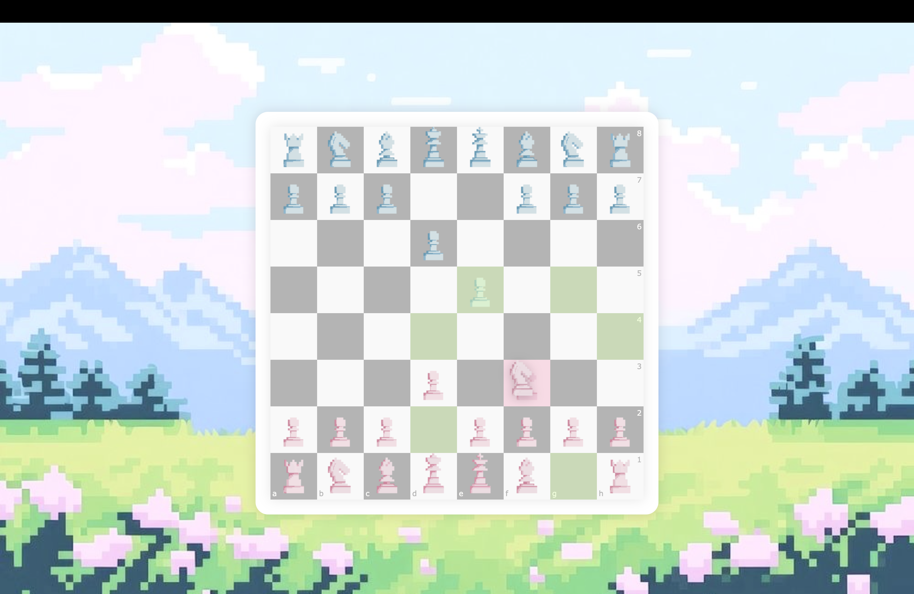

# Pixel Chess
A custom pixel-art chess game built from scratch, featuring original chess pieces designed by me.

## Overview

Pixel Chess is a playable chess game that combines programming and visual design. In addition to building the game itself, I created the full set of chess pieces in my own pastel pixel-art style to give the project a more personal and distinctive look.

## Features

- Playable chess board
- Custom-designed pixel chess pieces
- Original handmade visual assets
- Soft pastel pixel-art aesthetic

## Design

One of the main goals of this project was to make a traditional chess interface feel more charming and visually expressive. Rather than using default assets, I designed every chess piece myself to create a cohesive and original style.

## Author

Created and designed by me.
